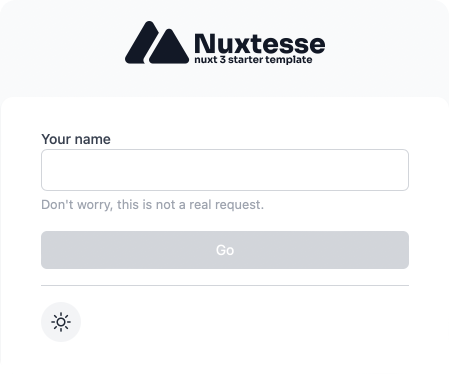

<p align="center">
  
</p>

<p align="center">
  <b>Nuxtesse</b> is a Nuxt 3 starter template based on <a href="https://github.com/antfu/vitesse">Vitesse</a> ♥️.
</p>

<br>

## Warning ⚠️

This is still a work in progress project. There are a lot of features that I am still working on.

## Features

- ⚡️ [Nuxt 3](https://v3.nuxtjs.org), [PNPM](https://pnpm.io), [Vue 3](https://pnpm.io)
- 🌐 [SPA](https://v3.nuxtjs.org/guide/deploy/static-hosting/)
- 🎨 [Tailwind CSS](https://tailwindcss.com)
- ⚙️ [ESLint](https://eslint.org), [@antfu's ESLint config](https://github.com/antfu/eslint-config)
- 👨‍🎨 [Stylelint](https://stylelint.io)
- 💡 [Script Setup](https://vuejs.org/api/sfc-script-setup.html) and [Reactivity Transform](https://vuejs.org/guide/extras/reactivity-transform.html)
- ☁ [Services](./src/services/) and [Providers](./src/providers/)
- ☀️ [Dark/Light themes](https://color-mode.nuxtjs.org)
- ~~🚧 Starter script~~ (WIP)
- ~~🚧 State Management with Pinia~~ (WIP)
- ~~🚧 i18n~~ (WIP)
- ~~🚧 PWA~~ (WIP)
- ~~🚧 Unit Testing & Snapshots~~ (WIP)
- ~~🚧 PWA~~ (WIP)

## Setup

```bash
npx degit castroclucas/nuxtesse nuxtesse-app
cd my-vitesse-app
pnpm i
```

Verify if Volar's [Take Over Mode](https://github.com/johnsoncodehk/volar/discussions/471) is enabled.

## Checklist

When you use this template, try follow the checklist to update your info properly

- [ ] Change the author name in `LICENSE`
- [ ] Change the title in `src/app.vue`
- [ ] Change the favicon in `public`
- [ ] Clean up the READMEs and remove routes

And, enjoy :)

## Why

I know that [vitesse-nuxt3](https://github.com/antfu/vitesse) exists and it is an amazing template!
But starter templates are something very personal and I wanted to create my own in order to customize it to my needs.

Thanks to [@antfu](https://github.com/antfu) for creating [Vitesse](https://github.com/antfu/vitesse) in which I based this project on.

And yes, I know the logo is just a copy of [Nuxt](https://nuxtjs.org)'s logo with a different color. I will change it in the future.
